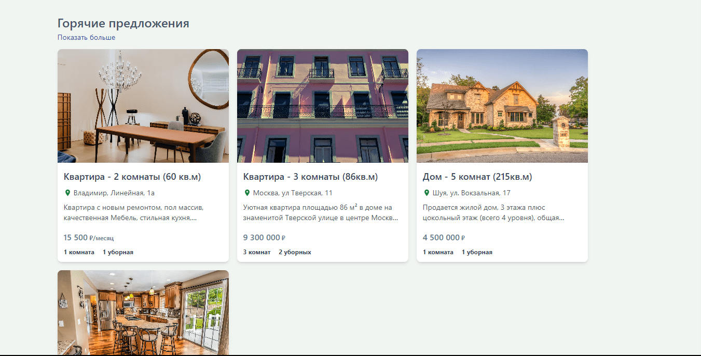
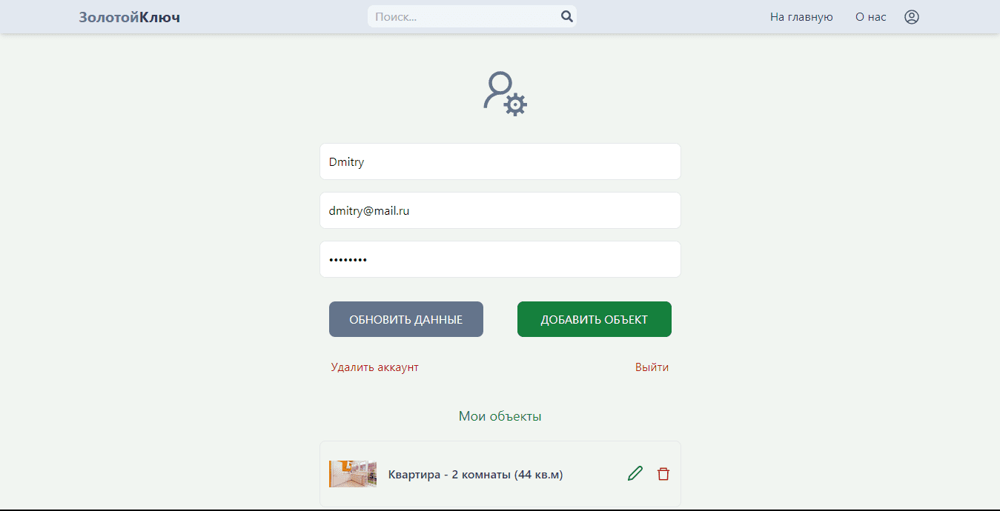
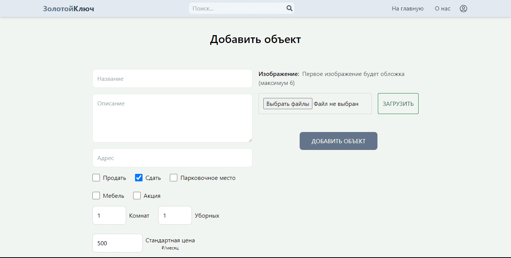
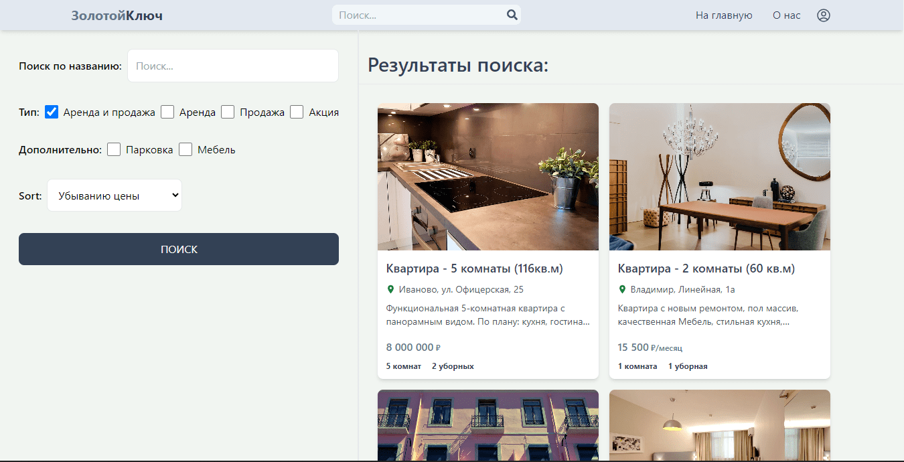

<p align="center">


</p>

<h1 align="center">Gold Key</h1>


<h2 align="center"><a target="_blank"  href="https://gold-key.onrender.com">Live Demo</a></h2>

<br />

<p align="center">
   


</p>

## Description

Gold key - a real estate agency for selling and renting real estate

## Profile

<p align="center">
   


</p>

On the profile page, you can update the user's data, delete the account or log out of it. And you can also add an object or view existing ones.

## Add an object

<p align="center">
   


</p>

Here you can add all the necessary information about the property

## Search

<p align="center">
   


</p>

A smart search engine will allow you to conveniently select a property

## About the project

#### Frontend stack: 

- React
- Redux-toolkit

#### Backend stack: 

- Node.js
- Express.js
- MongoDB

## Project setup

```
npm install
npm run start
```
